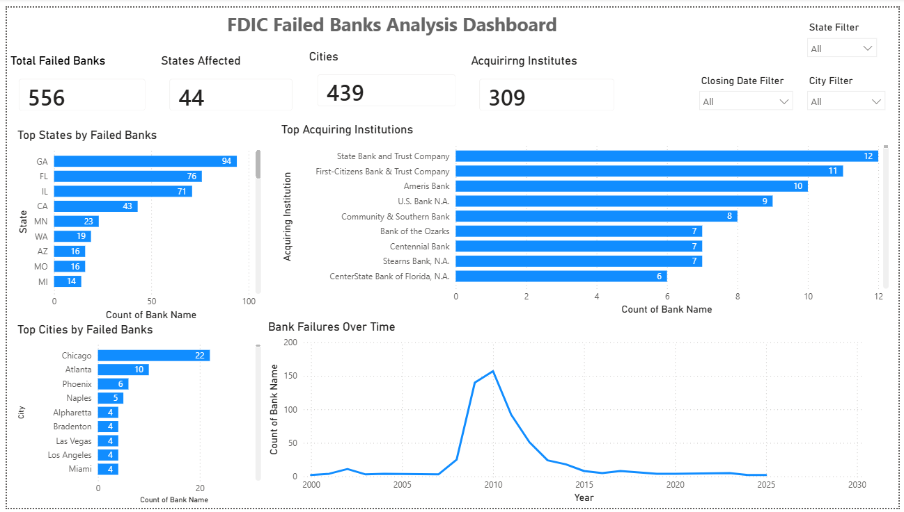

# FDIC Failed Banks Analysis Dashboard

An interactive Power BI dashboard analyzing historical U.S. bank failures 
using data from the FDIC (Federal Deposit Insurance Corporation).

## Tools Used
- Power BI
- Power Query (data cleaning & transformation)
- DAX (calculated measures)

## Data Source
[FDIC Failed Bank List](https://www.fdic.gov/bank-failures/failed-bank-list)

## Dashboard Overview
.

## Tools Used
- Power BI
- Power Query (data cleaning & transformation)
- DAX (calculated measures)

## Data Source
[FDIC Failed Bank List](https://www.fdic.gov/bank-failures/failed-bank-list)

## Dashboard Overview


## Data Model
Built a relationship between the Failed Banks fact table and a dedicated 
Date table to enable reliable time-based analysis (Year, Quarter, Month).


## Key DAX Measure Example
Calculated each state's percentage share of total bank failures using 
CALCULATE and ALL to remove filter context:


## DAX Formulas Used

**Date Table** (created to enable reliable time-based analysis)
```dax
Date = CALENDAR(DATE(2000,1,1), DATE(2025,12,31))
```

**Year** (calculated column on the Date table, used for grouping the trend chart)
```dax
Year = YEAR('Date'[Date])
```

**Total Failures** (base measure, counts total bank failures)
```dax
Total Failures = COUNTROWS('Failed banks')
```

**% of Total** (calculates each state's share of total failures, ignoring the current filter using ALL)
```dax
% of Total = DIVIDE([Total Failures], CALCULATE([Total Failures], ALL('Failed banks'[State])))
```

## Key Insights
- Bank failures peaked during 2008–2010, reflecting the global financial crisis.
- Georgia recorded the highest number of failed banks (94), about 17% of all failures.
- Illinois accounts for 12% of all bank failures nationally.
- Chicago had the highest number of failed banks among cities (22).
- Bank failures declined significantly after 2012.

## What This Project Demonstrates
- Data cleaning and transformation using Power Query
- Relational data modeling (fact table + dedicated Date table with relationships)
- DAX measures and calculated columns including COUNTROWS, DIVIDE, CALCULATE, and ALL
- Interactive dashboard design with KPI cards and slicers

## What I Learned
- How filter context works in DAX and why ALL() is needed for total-level calculations
- The importance of a dedicated Date table for reliable time-based analysis
- How to turn raw government data into a clear business narrative)
